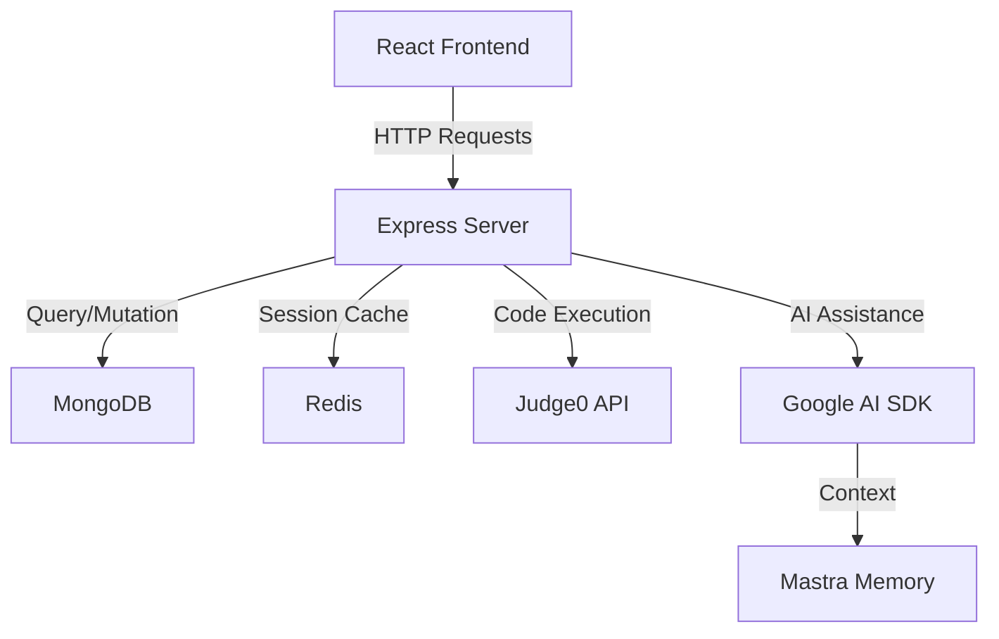

# 🔥 judge0 Arena - Next-Gen Competitive Programming Platform

<div align="center">


**A bleeding-edge competitive programming ecosystem with AI-powered mentorship**


</div>

---

## 🎯 Project Overview

**judge0 Arena** is a sophisticated, full-stack competitive programming platform that transcends traditional online judges by integrating AI-powered mentorship, real-time collaboration, and enterprise-grade code execution infrastructure. Built on the robust Judge0 API foundation, this platform delivers a seamless coding experience with advanced problem-solving assistance.

### 🧠 Core Philosophy

```typescript
interface PlatformVision {
  mission: "Democratize competitive programming education through AI-assisted learning";
  target: "Next-generation developers & algorithmic problem solvers";
  approach: "Guided learning over brute-force problem solving";
  innovation: "AI tutoring meets traditional judge systems";
}
```

---

## ⚡ Key Features & Capabilities

### 🎨 **Frontend Arsenal**
- **Monaco Editor Integration**: Professional-grade code editing with IntelliSense, syntax highlighting, and multi-language support
- **Responsive Material-UI Design**: Crafted with @mui/material and Tailwind CSS for pixel-perfect responsiveness
- **Real-time Code Execution**: Instant feedback with detailed test case analysis
- **Advanced Authentication**: OAuth2 Google integration with JWT-based session management
- **State Management**: Redux Toolkit with TypeScript for predictable state mutations
- **Form Validation**: Zod + React Hook Form for bulletproof data validation

### 🔧 **Backend Infrastructure**
- **Judge0 API Integration**: Secure code execution across 60+ programming languages
- **AI-Powered Mentorship**: Mastra framework with Google AI SDK for intelligent problem-solving guidance
- **Database Architecture**: MongoDB with Mongoose ODM for scalable data persistence
- **Caching Layer**: Redis-powered caching for lightning-fast response times
- **Rate Limiting**: Advanced middleware for API protection and fair usage
- **Session Management**: Secure JWT-based authentication with HTTP-only cookies

### 🤖 **AI Tutoring System**
```typescript
interface CodingAgent {
  role: "Expert Coding Tutor & Programming Assistant";
  capabilities: [
    "Step-by-step problem analysis",
    "Code debugging assistance",
    "Algorithm optimization suggestions",
    "Educational explanations",
    "Hint generation system"
  ];
  approach: "Socratic method for guided learning";
}
```

---

## 🏗️ Technical Architecture

### 📁 Project Structure
```
judge0-arena/
├── 🎨 client/judge0/          # React + TypeScript Frontend
│   ├── src/
│   │   ├── pages/             # Route components
│   │   ├── store/             # Redux state management
│   │   ├── utils/             # Axios client & utilities
│   │   └── assets/            # Static resources
│   └── package.json           # Frontend dependencies
│
├── ⚙️ server/                 # Node.js + Express Backend
│   ├── src/
│   │   ├── agents/            # AI tutoring agents
│   │   ├── config/            # Database & Redis config
│   │   ├── controllers/       # Business logic handlers
│   │   ├── middleware/        # Auth & security layers
│   │   ├── models/            # MongoDB schemas
│   │   ├── routes/            # API endpoint definitions
│   │   └── utils/             # Helper functions
│   └── package.json           # Backend dependencies
│
└── 📋 README.md               # This comprehensive guide
```

### 🔄 Data Flow Architecture


---

## 🚀 Quick Start Guide

### 📋 Prerequisites
Ensure your development environment includes:
```bash
node >= 18.0.0
pnpm >= 8.0.0  # Preferred package manager
mongodb >= 6.0
redis >= 7.0
```

### 🔑 Environment Configuration

#### Server Environment (`.env`)
```env
# Database Configuration
MONGO_URI=mongodb://localhost:27017/judge0-arena
REDIS_URL=redis://localhost:6379

# Authentication Secrets
JWT_SECRET=your-ultra-secure-jwt-secret-key
GOOGLE_CLIENT_ID=your-google-oauth-client-id
GOOGLE_CLIENT_SECRET=your-google-oauth-client-secret

# Judge0 API Configuration
JUDGE0_API_URL=https://judge0-ce.p.rapidapi.com
JUDGE0_API_KEY=your-rapidapi-key

# AI Integration
GOOGLE_AI_API_KEY=your-google-ai-api-key

# Server Configuration
PORT=8000
NODE_ENV=development
```

#### Client Environment (`.env`)
```env
VITE_API_BASE_URL=http://localhost:8000
VITE_GOOGLE_CLIENT_ID=your-google-oauth-client-id
```

### ⚡ Installation & Launch

#### 🔥 Turbocharged Setup
```powershell
# Clone the repository
git clone https://github.com/Saket6198/Judge0.git
cd judge0-arena

# Backend setup - Concurrent installation
cd server
pnpm install
pnpm run dev  # Launches with ts-node-dev hot reload

# Frontend setup - New terminal
cd ../client/judge0
pnpm install
pnpm run dev  # Vite dev server with HMR
```

#### 🐳 Docker Deployment (Optional)
```powershell
# Full-stack deployment with Docker Compose
docker-compose up -d

# Access points:
# Frontend: http://localhost:5173
# Backend API: http://localhost:8000
# MongoDB: localhost:27017
# Redis: localhost:6379
```

---

## 📚 API Documentation

### 🔐 Authentication Endpoints
```typescript
POST /user/register     # User registration with validation
POST /user/login        # JWT-based authentication
POST /user/google-auth  # OAuth2 Google sign-in
POST /user/logout       # Secure session termination
GET  /user/profile      # Protected user profile data
```

### 🧩 Problem Management
```typescript
GET    /problem/all            # Paginated problem listing
GET    /problem/:id            # Detailed problem specification
POST   /problem/create         # Admin-only problem creation
PUT    /problem/:id            # Problem modification
DELETE /problem/:id            # Problem removal
```

### 💻 Code Submission & Execution
```typescript
POST /submission/submit        # Code execution against test cases
GET  /submission/history/:id   # User submission history
GET  /submission/result/:id    # Detailed execution results
```

### 🤖 AI Tutoring Interface
```typescript
POST /chat/problem-help        # AI assistance for specific problems
POST /chat/debug-code          # Code debugging assistance
POST /chat/explain-concept     # Algorithm explanation requests
```

---

## 🛠️ Technology Stack Deep Dive

### 🎨 **Frontend Technologies**
| Technology | Version | Purpose | Configuration |
|------------|---------|---------|---------------|
| **React** | ^19.1.0 | UI Component Library | JSX with TypeScript |
| **TypeScript** | ~5.8.3 | Type Safety & Developer Experience | Strict mode enabled |
| **Vite** | ^6.3.5 | Build Tool & Dev Server | SWC for fast compilation |
| **Redux Toolkit** | ^2.8.2 | State Management | RTK Query for data fetching |
| **React Router** | ^7.6.2 | Client-side Routing | Protected route implementation |
| **Material-UI** | ^7.1.2 | Component Library | Custom theme configuration |
| **Tailwind CSS** | ^4.1.10 | Utility-first Styling | JIT compilation enabled |
| **Monaco Editor** | ^4.7.0 | Code Editor | Multi-language syntax support |
| **Axios** | ^1.10.0 | HTTP Client | Interceptors for auth handling |

### ⚙️ **Backend Technologies**
| Technology | Version | Purpose | Configuration |
|------------|---------|---------|---------------|
| **Node.js** | ^18.0.0 | Runtime Environment | ES2022 target compilation |
| **Express** | ^5.1.0 | Web Framework | Middleware-based architecture |
| **TypeScript** | ^5.8.3 | Type Safety | Strict compilation settings |
| **MongoDB** | ^6.15.0 | Primary Database | Mongoose ODM integration |
| **Redis** | ^4.7.1 | Caching & Sessions | JSON data structure support |
| **JWT** | ^9.0.2 | Authentication | RS256 asymmetric encryption |
| **Mastra** | ^0.10.8 | AI Agent Framework | Memory-enabled conversations |
| **Google AI SDK** | ^1.2.19 | Language Model | Gemini Pro integration |

---

## 🔒 Security Implementation

### 🛡️ **Authentication & Authorization**
```typescript
interface SecurityFeatures {
  authentication: {
    strategy: "JWT + HTTP-only cookies";
    providers: ["Local", "Google OAuth2"];
    tokenExpiry: "24h access, 7d refresh";
    encryption: "bcrypt for passwords, RS256 for JWT";
  };
  
  authorization: {
    roleSystem: ["user", "admin", "moderator"];
    routeProtection: "Middleware-based guards";
    apiSecurity: "Rate limiting + CORS";
  };
  
  dataProtection: {
    validation: "Zod schemas on both ends";
    sanitization: "Express-validator middleware";
    encryption: "AES-256 for sensitive data";
  };
}
```

### 🚫 **Rate Limiting Strategy**
```typescript
const rateLimitConfig = {
  submission: "10 requests/minute per user",
  authentication: "5 attempts/15 minutes",
  problemFetch: "100 requests/hour",
  aiChat: "20 messages/hour per user"
};
```

---


## 📄 License & Legal

This project is licensed under the **MIT License** - see the [LICENSE](LICENSE) file for details.


<div align="center">

**Built with ❤️ by the Saket Singh**

*Empowering the next generation of competitive programmers through AI-assisted learning*


</div>
